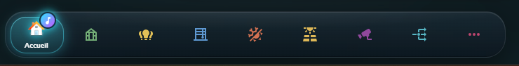
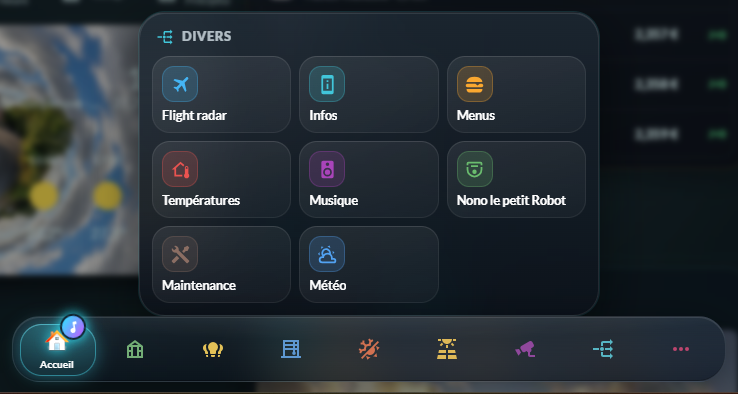
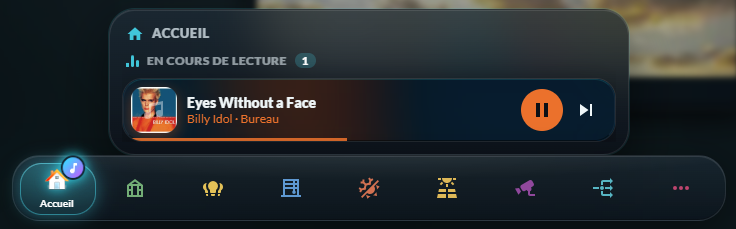
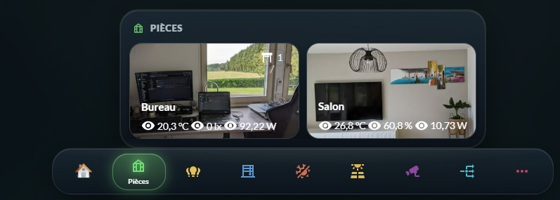
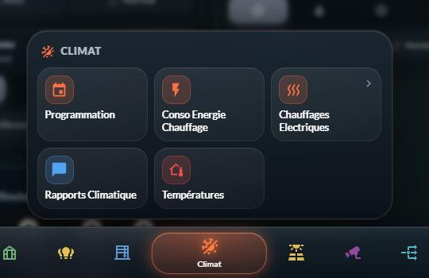
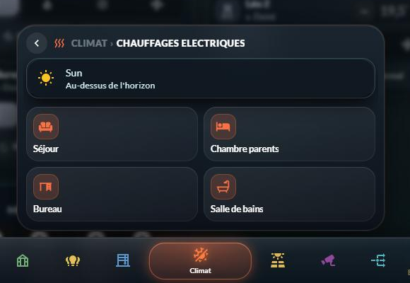
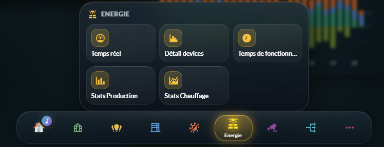

# 🧭 HOLM Navbar Card

[](https://hacs.xyz/)


**Une barre de navigation en verre dépoli pour tout votre tableau de bord Home Assistant : animée, vivante, et réglée entièrement à la souris.**

HOLM Navbar Card pose en bas de l'écran (ou sur le côté, sur ordinateur) un **dock flottant façon « verre liquide »** qui relie toutes les vues de votre dashboard. Une bulle lumineuse glisse d'un onglet à l'autre, les icônes rebondissent au toucher, des **pastilles** comptent ce qui est allumé ou ouvert, un **appui long** ouvre un panneau de raccourcis… et si de la musique joue dans la maison, **une petite note de musique** vous le dit.

> ✨ **Zéro YAML.** On ajoute la carte depuis le sélecteur de cartes, on crée ses onglets dans l'éditeur visuel (icône, couleur, vue, sous-menus, pastilles…) et **la même barre apparaît sur toutes les vues**.

### En bref

- 🫧 **Dock en verre animé** : bulle active qui glisse, icônes colorées, rebond et vibration au toucher.
- 🗂️ **Une seule configuration pour tout le dashboard** : une carte « maître » contient les onglets, les autres vues posent juste la carte, sans rien régler.
- 🚀 **Pas de clignotement** : la barre reste posée sur la page quand on change de vue.
- 📂 **Sous-menus** à l'appui long : un panneau de tuiles pour aller vers d'autres vues ou **lancer une action** (script, scène, basculer une lumière…), avec **l'état en direct** de l'entité (Garage · Ouvert, Alarme · Armée…).
- 🪆 **Sous-menus imbriqués** : une tuile peut ouvrir son propre sous-menu (appui long), avec bouton retour et fil d'Ariane.
- 🃏 **Cartes Lovelace dans le panneau** : thermostat, caméra, graphique… n'importe quelle carte, ajoutée avec **le sélecteur et l'éditeur de cartes de Home Assistant**.
- 🌍 **8 langues** : français, anglais, allemand, espagnol, italien, néerlandais, portugais, polonais (langue de Home Assistant par défaut).
- 🔴 **Pastilles dynamiques** : nombre de lumières allumées, de volets ouverts, valeur d'un capteur…
- 🎵 **Musique** : une note animée sur l'onglet quand un lecteur joue, **les lecteurs en cours à l'appui long**, et un **mini lecteur** au-dessus de la barre *(nécessite [HOLM Music Card](https://github.com/kaaribou/holm-music-card), voir [Prérequis](#prérequis))*.
- 📱💻 **Mobile et ordinateur** : dockée ou flottante sur téléphone ; en bas, à gauche, à droite ou masquée sur grand écran.
- 👤 **Onglets par utilisateur** : un onglet peut n'être visible que pour certaines personnes.
- 🙈 **Masquage au défilement** (optionnel) pour laisser toute la place au contenu.



| Sous-menu (appui long) | Lecteurs en cours (appui long sur Accueil) |
|---|---|
|  |  |

### 🆕 Nouveautés de la 1.6.0

#### 🃏 Des cartes Lovelace dans les sous-menus

C'est la grande nouveauté : un onglet ou une tuile peut maintenant afficher **n'importe quelle carte Lovelace** dans son panneau (carte de pièce, thermostat, caméra, graphique, vos cartes HOLM…). Ici, l'onglet *Pièces* affiche deux cartes de pièce côte à côte :



- **Ajout en un clic** depuis un sélecteur rapide (recherche, cartes Home Assistant et cartes personnalisées), puis réglage avec **l'éditeur de la carte** de Home Assistant (visuel ou code).
- **Dimensionnement** : largeur du panneau (étroite à pleine largeur), **1 à 3 colonnes** de cartes, et largeur de chaque carte (une ou plusieurs colonnes, ou toute la ligne).
- **Les actions des cartes fonctionnent** : un clic sur la carte *Bureau* ouvre la vue du bureau et referme le panneau ; appui long et fenêtre d'informations aussi.
- Cartes **seules** ou **avec des tuiles**, au-dessus ou en dessous.
- Les cartes suivent l'état de Home Assistant en direct et sont détachées quand le panneau se ferme (pas de caméra qui tourne en arrière-plan).

→ Détails dans [Cartes dans le panneau](#cartes-dans-le-panneau).

#### 🪆 Sous-menus imbriqués

Un **appui long sur une tuile** ouvre son propre sous-menu, jusqu'à **3 niveaux** (Climat › Chauffages › Étage). Navigation avec le bouton **retour ‹**, le **fil d'Ariane** cliquable ou la touche **Échap**. Une tuile qui n'a ni vue ni action ouvre son sous-menu au simple toucher ; une petite flèche signale les tuiles qui en ont un.

#### 📝 Libellés lisibles en entier

Les noms des tuiles passent sur **2 lignes** au lieu d'être coupés (« Conso Energie Chauffage »), avec césure propre des mots longs. Option *Lignes des libellés* : 1, 2, 3 ou illimité. Dans la barre, les libellés de plusieurs mots passent aussi à la ligne.

#### 🌍 8 langues

Carte et éditeur traduits en **français, anglais, allemand, espagnol, italien, néerlandais, portugais et polonais**, selon la langue de votre profil Home Assistant, ou forcée avec l'option *Langue*. Les états affichés sur les tuiles utilisent les traductions officielles de Home Assistant.

| Libellés sur 2 lignes | Sous-menu imbriqué avec une carte |
|---|---|
|  |  |

---

## Sommaire

- [Prérequis](#prérequis)
- [Installation](#installation)
- [Mise en place en 2 minutes](#mise-en-place-en-2-minutes)
- [Les onglets](#les-onglets)
- [Sous-menus](#sous-menus)
- [Cartes dans le panneau](#cartes-dans-le-panneau)
- [Pastilles](#pastilles)
- [Musique](#musique)
- [Options générales](#options-générales)
- [Exemple YAML complet](#exemple-yaml-complet)
- [FAQ / dépannage](#faq--dépannage)

---

## Prérequis

- **Home Assistant 2025.1** ou plus récent.
- **Pour les fonctions musique uniquement** (note de musique, lecteurs en cours, mini lecteur) :

> [!IMPORTANT]
> Les fonctions musique de la barre **utilisent le lecteur [HOLM Music Card](https://github.com/kaaribou/holm-music-card)** : c'est lui qui s'affiche dans le panneau « En cours de lecture » et dans le mini lecteur.
> **Il doit donc être installé**, ainsi que l'intégration **[Music Assistant](https://music-assistant.io/)** dans Home Assistant.
> HACS ne peut pas installer une carte « dépendante » automatiquement : installez les deux cartes, puis rechargez la page.
>
> Sans HOLM Music Card, la barre fonctionne normalement ; seules les fonctions musique restent inactives (l'éditeur vous le signale).

---

## Installation

### Avec HACS (recommandé)

1. HACS → menu ⋮ → **Dépôts personnalisés**.
2. Ajoutez `https://github.com/kaaribou/holm-navbar-card`, catégorie **Tableau de bord** (*Dashboard / Plugin*).
3. Recherchez **HOLM Navbar Card** → **Télécharger**.
4. *(Pour la musique)* faites de même avec `https://github.com/kaaribou/holm-music-card`.
5. Rechargez la page (Ctrl + F5).

HACS ajoute la ressource automatiquement et vous prévient des nouvelles versions.

### Manuellement

1. Copiez `dist/holm-navbar-card.js` dans `config/www/community/holm-navbar-card/`.
2. **Paramètres → Tableaux de bord → ⋮ → Ressources → Ajouter** : `/local/community/holm-navbar-card/holm-navbar-card.js`, type **Module JavaScript**.
3. Rechargez la page.

---

## Mise en place en 2 minutes

1. Ouvrez la vue principale de votre dashboard (par exemple *Accueil*) → **Modifier** → **Ajouter une carte** → **HOLM Navbar**.
2. Créez vos onglets dans l'éditeur (libellé, icône, couleur, vue à ouvrir). Cette carte devient la **carte maître**.
3. Dans **chacune des autres vues**, ajoutez aussi la carte **HOLM Navbar**, **sans rien régler** : elle retrouve toute seule la configuration de la carte maître.

```yaml
# dans les autres vues, c'est tout :
type: custom:holm-navbar-card
```

En mode édition, la carte s'affiche comme un petit aperçu (« carte maître » ou « config commune ») ; en utilisation normale elle est invisible et **la barre apparaît en bas de l'écran**. Toute modification de la carte maître est appliquée partout, instantanément.

> 💡 Une vue « secondaire » peut tout de même changer localement `labels`, `desktop_position`, `mobile_style` ou `auto_hide`.

---

## Les onglets

| Réglage | Description |
|---|---|
| **Libellé** | Texte sous l'icône (affiché selon l'option *Libellés*). |
| **Icône** / **Image** | Une icône `mdi:` ou une image (`/local/…png`) qui la remplace. |
| **Couleur** | `#hex`, `rgb(…)` ou un nom de couleur de thème (`red`, `amber`…). Colore l'icône et la bulle. |
| **Vue à ouvrir** | Le chemin de la vue (`/lovelace/lumieres`). L'onglet s'allume quand on est sur cette vue **ou** sur une vue de son sous-menu. |
| **Au toucher** | Aller à une vue (par défaut), basculer l'entité, ouvrir sa fiche, lancer une action… |
| **Pastille** | Entités à compter (voir [Pastilles](#pastilles)). |
| **Note de musique…** | Active l'indicateur musique et la liste des lecteurs à l'appui long (voir [Musique](#musique)). |
| **Visible seulement pour** | Noms d'utilisateurs Home Assistant. Vide = tout le monde. |

Un onglet **avec une vue** y mène au toucher et ouvre son sous-menu à l'appui long. Un onglet **sans vue** ouvre directement son sous-menu.

---

## Sous-menus

Chaque onglet peut contenir des **tuiles** affichées dans un panneau en verre à l'appui long :

- une tuile avec une **vue** y emmène ;
- une tuile avec une **action** (`perform-action` : `script.bonne_nuit`, `light.turn_off`…) l'exécute sans fermer le panneau ;
- une tuile liée à une **entité** affiche **son état en direct** et s'illumine quand elle est active ; un appui long ouvre sa fiche.

Les libellés trop longs passent à la ligne (2 lignes par défaut, option **Lignes des libellés**).



### 🪆 Sous-menus imbriqués

Dans l'éditeur, chaque tuile d'un sous-menu a elle aussi sa section **Sous-menu** :

- une tuile **avec une vue ou une action** garde son comportement au toucher, et **son sous-menu s'ouvre à l'appui long** ;
- une tuile **sans vue ni action** ouvre son sous-menu **au simple toucher** ;
- une petite flèche › signale les tuiles qui ont un sous-menu ;
- le panneau glisse vers le niveau suivant ; **‹** (ou la touche Échap) revient en arrière, et un toucher sur le fil d'Ariane remonte directement à un niveau ;
- jusqu'à **3 niveaux** : onglet → sous-menu → sous-sous-menu.

---

## Cartes dans le panneau

Chaque onglet et chaque tuile de sous-menu peut afficher des **cartes Lovelace** dans son panneau : un thermostat dans le sous-menu *Chauffage*, la caméra du portail dans *Sécurité*, un graphique de consommation dans *Énergie*…

1. Dans l'éditeur, ouvrez l'onglet ou la tuile, section **Cartes** → **Ajouter une carte**.
2. Choisissez le type de carte dans **le sélecteur rapide** : tapez quelques lettres pour filtrer, la carte est ajoutée avec une configuration de départ. Le lien « Afficher les aperçus » ouvre le sélecteur complet de Home Assistant, plus lent.
3. Réglez-la avec **l'éditeur de la carte** ; le bouton `{ }` bascule en éditeur de code.
4. Si le panneau contient aussi des tuiles, choisissez la **position des cartes** : au-dessus (par défaut) ou en dessous des tuiles.

Un onglet ou une tuile qui n'a **que des cartes** (sans tuiles) ouvre directement son panneau de cartes. Les cartes reçoivent l'état de Home Assistant en direct et sont détachées à la fermeture du panneau (une caméra ne tourne pas en arrière-plan).

Les actions des cartes (clic, appui long, navigation, fenêtre d'informations…) fonctionnent comme sur un tableau de bord.

### Dimensionner les cartes

| Réglage | Effet |
|---|---|
| **Largeur du panneau** | automatique, étroite (360 px), normale (460 px), large (640 px), très large (860 px) ou pleine largeur |
| **Colonnes de cartes** | 1, 2 ou 3 cartes côte à côte |
| **Largeur de la carte** | pour chaque carte, le nombre de colonnes occupées, ou toute la ligne |

Le nombre de colonnes est respecté aussi sur téléphone (choisissez 1 colonne si vous préférez des cartes empilées).

```yaml
cards_columns: 2
panel_width: large
cards:
  - type: area
    area: bureau
  - type: tile
    entity: light.bureau
cards_size:
  - null            # 1 colonne
  - { span: full }  # toute la ligne
```

---

## Pastilles

- **Compter des entités** : choisissez plusieurs entités ; la pastille affiche combien sont *actives* (allumées, ouvertes, en lecture, déverrouillées, alarme armée…).
- **Une valeur** (YAML) : `badge: { entity: sensor.xxx }` affiche la valeur si elle est positive, ou un point pulsant si l'entité est active.
- **Couleur** (YAML) : `badge: { color: amber }`.

---

## Musique

> [!IMPORTANT]
> Nécessite **[HOLM Music Card](https://github.com/kaaribou/holm-music-card)** + l'intégration **Music Assistant**.

### 🎵 La note de musique sur un onglet

Activez **« Note de musique si lecture en cours + lecteurs à l'appui long »** sur l'onglet de votre choix (par exemple *Accueil*) :

- dès qu'**un lecteur Music Assistant joue**, une **note de musique animée** apparaît sur l'onglet ;
- s'il y en a plusieurs, elle affiche leur **nombre** (♪ 2) ;
- des enceintes **regroupées** (multiroom) ne comptent que pour un lecteur.

### 🎧 Les lecteurs en cours à l'appui long

Un **appui long** sur cet onglet ouvre le panneau **« En cours de lecture »** : un **mini lecteur** par enceinte qui joue (ou en pause), avec pochette, progression et lecture/pause. **Un toucher sur un mini lecteur ouvre le lecteur complet** (file d'attente, bibliothèque, enceintes…). Si l'onglet a aussi des tuiles de sous-menu, elles s'affichent en dessous.


### 📻 Le mini lecteur au-dessus de la barre

Dans la section **Mini lecteur de musique** de la carte maître :

| Réglage | Description |
|---|---|
| **Mini lecteur Music Assistant** | Le lecteur affiché en permanence au-dessus de la barre. |
| **Afficher le mini lecteur** | *Seulement pendant la lecture* (par défaut) ou *Toujours*. |
| **Style de pochette** | Pochette carrée ou vinyle qui tourne. |
| **Lecteurs surveillés** | Les lecteurs pris en compte par la note de musique et le panneau. Vide = **tous** les lecteurs Music Assistant. |

---

## Options générales

| Option | Valeurs | Par défaut |
|---|---|---|
| `labels` | `active` (onglet actif), `all`, `none` | `active` |
| `mobile_style` | `docked` (collée en bas), `floating` | `docked` |
| `desktop_position` | `bottom`, `left`, `right`, `hidden` | `bottom` |
| `auto_hide` | masquer la barre en faisant défiler | `false` |
| `haptic` | vibration au toucher (application mobile) | `true` |
| `accent` | couleur principale | `#26c6da` |
| `label_lines` | lignes des libellés : `1`, `2`, `3`, `0` (illimité) | `2` |
| `language` | `auto` (langue de HA), `fr`, `en`, `de`, `es`, `it`, `nl`, `pt`, `pl` | `auto` |
| `music_entity` | lecteur du mini lecteur | — |
| `music_show` | `active`, `always` | `active` |
| `music_artwork` | `square`, `vinyl` | `square` |
| `music_players` | liste de lecteurs surveillés | tous |

Par onglet ou par tuile : `popup` (tuiles du sous-menu, imbricables), `cards` (liste de cartes Lovelace), `cards_position` (`top` ou `bottom`), `panel_width` (`narrow`, `normal`, `large`, `xlarge`, `full`), `cards_columns` (`1` à `3`), `cards_size` (largeur de chaque carte : `{ span: 2 }` ou `{ span: full }`).

---

## Exemple YAML complet

```yaml
type: custom:holm-navbar-card
labels: active
mobile_style: docked
desktop_position: bottom
music_entity: media_player.salon
music_show: active
routes:
  - label: Accueil
    icon: mdi:home
    url: /lovelace/accueil
    color: "#26c6da"
    music: true
  - label: Lumières
    icon: mdi:lightbulb-group
    url: /lovelace/lumieres
    color: "#ffca28"
    badge:
      entities: [light.salon, light.cuisine, light.bureau]
  - label: Divers
    icon: mdi:dots-horizontal
    color: "#ab47bc"
    popup:
      - label: Garage
        icon: mdi:garage
        entity: cover.garage
        tap_action: { action: toggle }
      - label: Bonne nuit
        icon: mdi:weather-night
        tap_action:
          action: perform-action
          perform_action: script.bonne_nuit
      - label: Météo
        icon: mdi:weather-partly-cloudy
        url: /lovelace/meteo
  - label: Climat
    icon: mdi:sun-snowflake-variant
    url: /lovelace/chauffage
    color: "#ff7043"
    popup:
      - label: Chauffages électriques
        icon: mdi:radiator
        url: /lovelace/chauffages-electriques   # toucher : la vue ; appui long : le sous-menu
        cards:
          - type: thermostat
            entity: climate.sejour
        popup:
          - label: Séjour
            icon: mdi:sofa
            entity: climate.sejour
            tap_action: { action: more-info }
          - label: Chambre
            icon: mdi:bed
            entity: climate.chambre
            tap_action: { action: more-info }
  - label: Admin
    icon: mdi:tools
    url: /lovelace/maintenance
    users: [olivier]
```

---

## FAQ / dépannage

| Problème | Solution |
|---|---|
| La barre n'apparaît pas sur une vue | Ajoutez la carte `custom:holm-navbar-card` dans cette vue (sans réglage). La carte maître doit être dans **le même dashboard**. |
| La barre cache le bas de la page | La carte ajoute automatiquement une marge en bas de la vue ; rechargez la page si besoin. |
| Pas de note de musique / panneau vide avec un message | Installez **HOLM Music Card** et **Music Assistant**, puis rechargez la page (Ctrl + F5). |
| Un lecteur n'est pas pris en compte | Seuls les lecteurs de l'intégration **Music Assistant** sont surveillés ; vérifiez la liste *Lecteurs surveillés*. |
| L'éditeur d'une carte ne s'affiche pas | Attendez une seconde (il est préchargé à l'ouverture de l'éditeur) ou rechargez la page ; vous pouvez aussi passer par l'éditeur de code `{ }`. |
| La langue n'est pas la bonne | Option **Langue** de la carte maître (par défaut : la langue de votre profil Home Assistant). |
| La nouvelle version ne s'affiche pas | Videz le cache (Ctrl + F5, ou « Recharger les ressources » dans l'application mobile). |

---

## Un petit merci ?

La barre vous plaît ? Vous pouvez m'offrir une bière 🍺

[](https://paypal.me/kaaribou)

---

## Licence

Code sous licence **MIT** — © kaaribou. Voir le [CHANGELOG](CHANGELOG.md).

Fait partie de **HOLM — Home Orchestration & Living Management** : la gestion et l'orchestration intelligente de la maison.

Les autres projets : [Volets HOLM](https://github.com/kaaribou/volets-holm) · [Climat HOLM](https://github.com/kaaribou/climat-holm) · [Carburant HOLM](https://github.com/kaaribou/carburant-holm) · [Commandes à la maison HOLM](https://github.com/kaaribou/commandes-holm) · [HOLM Climate Card](https://github.com/kaaribou/climate-card-holm) · [HOLM Music Card](https://github.com/kaaribou/holm-music-card) · [HOLM Sentinel Card](https://github.com/kaaribou/holm-sentinel-card) · [HOLM Security Card](https://github.com/kaaribou/holm-security-card) · [HOLM Recordings Card](https://github.com/kaaribou/holm-recordings-card) · [HOLM Covers Card](https://github.com/kaaribou/holm-covers-card) · [HOLM Power Flow Card](https://github.com/kaaribou/holm-power-flow-card) · [HOLM Energy Cards](https://github.com/kaaribou/holm-energy-cards) · [HOLM Radiator Card](https://github.com/kaaribou/holm-radiator-card) · [HOLM Floor Card](https://github.com/kaaribou/holm-floor-card) · [HOLM Smoke Card](https://github.com/kaaribou/holm-smoke-card) · [HOLM BG Card](https://github.com/kaaribou/holm-bg-card).
